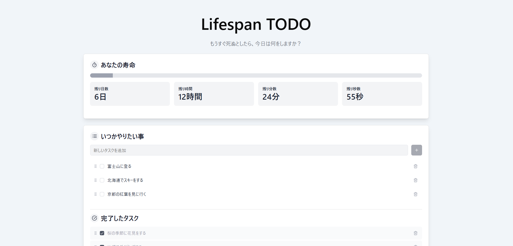

# Lifespan TODO

**あなたの残り時間を意識し、本当に優先すべきタスクに集中するための TODO アプリケーション**

人生の残り時間（週単位）を視覚的に表示することで、日々のタスクに新たな視点をもたらします。時間を意識することで、より計画的に、そして重要なことに集中できるようサポートします。

## ✨ 主な機能

- **残り時間の可視化:** 週の残り時間を日・時間・分・秒でリアルタイム表示
- **タスク管理:**
  - 簡単なタスク追加
  - タスク内容の編集
  - 不要なタスクの削除
  - ワンクリックでの完了/未完了切り替え
- **直感的な操作:** ドラッグ＆ドロップによるタスクの並べ替え
- **整理された表示:** 完了済みタスクと未完了タスクを分けて表示
- **データ永続化:** 入力したタスクはブラウザのローカルストレージに自動保存

## 🚀 技術スタック

- **フロントエンド:**
  - React 19
  - TypeScript
  - Vite
- **スタイリング:**
  - TailwindCSS
  - Shadcn/UI
  - clsx, tailwind-merge
- **アニメーション:**
  - Framer Motion
- **状態管理・ユーティリティ:**
  - React Hooks
  - date-fns
  - Lucide React

## 🛠️ 開発環境のセットアップ

1.  **リポジトリをクローン:**

    ```bash
    git clone https://github.com/あなたのユーザー名/lifespan-todo.git
    cd lifespan-todo
    ```

2.  **依存パッケージのインストール:**

    ```bash
    npm install
    # または yarn install
    ```

3.  **開発サーバーの起動:**

    ```bash
    npm run dev
    # または yarn dev
    ```

    ブラウザで `http://localhost:5173` (ポートは異なる場合があります) を開きます。

## 📁 プロジェクト構成 (src ディレクトリ)

```
src
├── App.tsx           # アプリケーションのメインコンポーネント
├── main.tsx          # アプリケーションのエントリーポイント
├── index.css         # グローバルなスタイル
├── components/       # 再利用可能なUIコンポーネント
│   ├── todo/         # TODO関連コンポーネント
│   ├── ui/           # Shadcn/UIベースのコンポーネント
│   └── ...
├── hooks/            # カスタムフック (例: useTodos)
├── lib/              # Shadcn/UIの設定など (例: utils.ts)
├── utils/            # 汎用的なユーティリティ関数
├── mocks/            # (もしあれば) モックデータやハンドラ
└── vite-env.d.ts     # Vite環境変数の型定義
```
